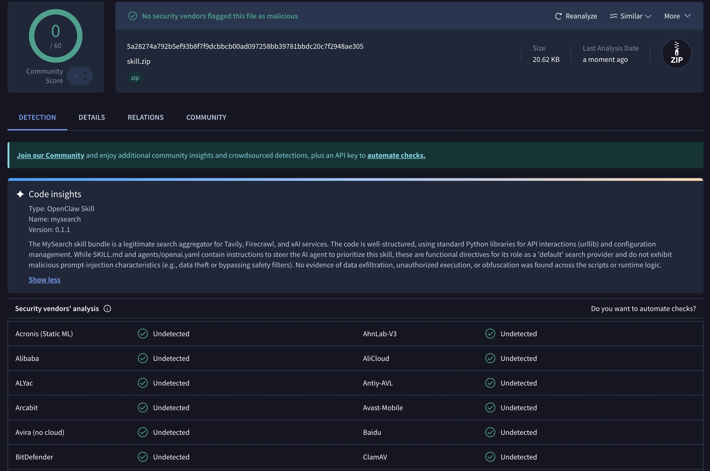
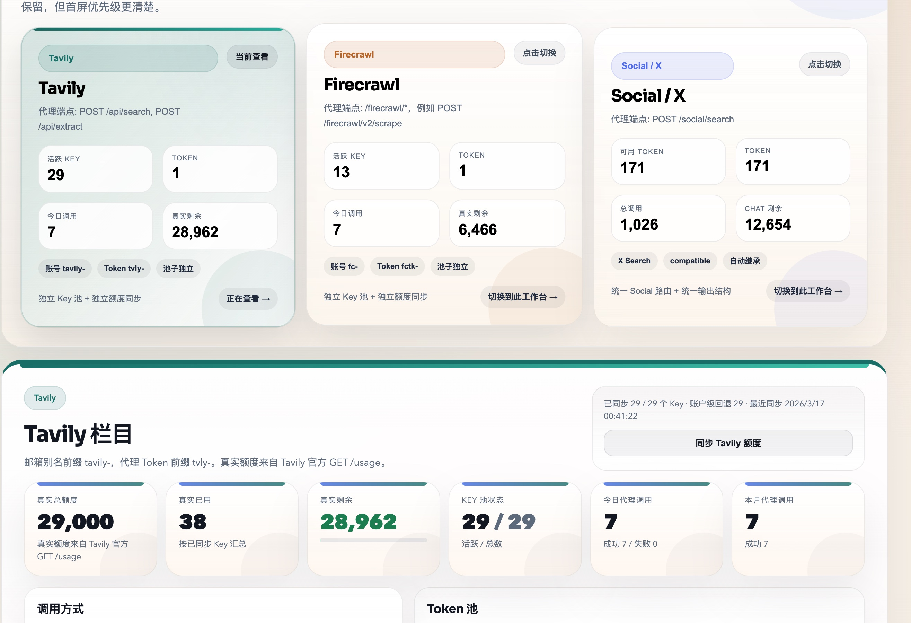

# MySearch Proxy

[中文说明](./README.md)

`MySearch Proxy` is a public-facing search stack for `Codex`, `Claude Code`,
`OpenClaw`, and custom agent workflows.

It combines three things that are usually split across separate projects:

- an installable search `MCP`
- reusable search `Skill` packages
- a unified `Proxy Console` for provider routing and operations

Project entry points:

- GitHub:
  [skernelx/MySearch-Proxy](https://github.com/skernelx/MySearch-Proxy)
- OpenClaw Hub Skill:
  [clawhub.ai/skernelx/mysearch](https://clawhub.ai/skernelx/mysearch)
- Recommended Tavily / Firecrawl provider layer:
  [skernelx/tavily-key-generator](https://github.com/skernelx/tavily-key-generator)


This is not just another Tavily wrapper.

The goal is to make `Tavily`, `Firecrawl`, and optional `X / Social` search
work as one reusable product that can be installed locally, shared publicly,
and routed through the same runtime across multiple environments.

The public OpenClaw page is live here:

- [clawhub.ai/skernelx/mysearch](https://clawhub.ai/skernelx/mysearch)
- The screenshot below is a real capture from `2026-03-17`
- Always use the live ClawHub page as the source of truth for current scan status



## What is in this repository

- [`mysearch/`](./mysearch/README_EN.md)
  - the installable MySearch MCP
  - ships `search`, `extract_url`, `research`, and `mysearch_health`
- [`proxy/`](./proxy/README_EN.md)
  - the proxy layer and web console
  - manages Tavily / Firecrawl key pools, downstream tokens, quota sync,
    and `/social/search`
- [`skill/README_EN.md`](./skill/README_EN.md)
  - MySearch skill guide for `Codex` / `Claude Code`
  - includes the "tell the AI to install it for me" flow
- `openclaw/`
  - bundled MySearch skill for OpenClaw / ClawHub
- [`docs/mysearch-architecture.md`](./docs/mysearch-architecture.md)
  - architecture and design boundaries

## What problem this project solves

Many search MCPs or search skills have the same limitations:

- they only do web search and cannot extract content cleanly
- they work for news, but not for docs, GitHub, PDFs, pricing, or changelogs
- they ship prompts but not a real MCP runtime
- they ship a key panel but not an agent-ready search workflow
- they assume official APIs only and become awkward to self-host
- they lose most of their value if X / Social is unavailable

`MySearch Proxy` solves this by separating the stack into clear layers:

```text
tavily-key-generator
  -> provider layer for Tavily / Firecrawl and optional aggregation APIs

MySearch Proxy
  -> MCP, Skills, OpenClaw Skill, Proxy Console, Social / X routing

Codex / Claude Code / OpenClaw / custom agents
  -> one shared search entry
```

The default recommendation is not "paste official keys everywhere".
The recommended public deployment is:

- `tavily-key-generator` for Tavily / Firecrawl provider delivery
- `MySearch Proxy` for routing, MCP, skills, and console

## Why it is better than typical alternatives

### 1. It is not a single-provider MCP

`MySearch` routes by task type:

- general web and news -> Tavily
- docs, GitHub, PDFs, pricing, changelogs, extraction -> Firecrawl
- X / Social -> xAI or compatible `/social/search`

That makes it a real search orchestrator, not a one-provider wrapper.

### 2. It is not "just a skill"

This repository ships:

- MCP
- Codex / Claude Code skill
- OpenClaw skill
- Proxy Console

So the same search logic can be reused across local agents, OpenClaw, and team
gateways instead of being rewritten per runtime.

### 3. It handles extraction and lightweight research

The value is not only `search`:

- `extract_url`
  - prefers Firecrawl and falls back to Tavily extract
- `research`
  - bundles search, extraction, and evidence into a lightweight research flow

That is much more useful for agent workflows than returning a few links.

### 4. Official-first, but compatible-friendly

You can:

- use official Tavily / Firecrawl / xAI APIs
- override `BASE_URL + PATH + AUTH_*`
- route Tavily / Firecrawl through your own aggregation gateway
- route X / Social through a compatible `/social/search`

That matters if you want a reusable public project instead of a one-off setup.

### 5. X / Social is optional, not the installation gate

Without `xAI` or `grok2api`, the stack still supports:

- `web`
- `news`
- `docs`
- `github`
- `pdf`
- `extract`
- `research`

Only explicit social routes degrade.

## Where to use it

### 1. As the default search entry for local coding assistants

Works well for:

- `Codex`
- `Claude Code`
- other MCP-capable local assistants

Use cases:

- current web search
- docs / GitHub / pricing / changelog lookup
- single-page content extraction
- lightweight research packs
- optional X / Social evidence

### 2. As the default search skill for OpenClaw

Useful if you want to:

- replace an older Tavily-only search skill
- give OpenClaw a better web + docs + social workflow
- publish a reusable search skill on ClawHub

### 3. As a shared team gateway

Useful if you want:

- one shared entry for multiple downstream tools
- separate upstream provider keys from downstream tokens
- a single UI for Tavily, Firecrawl, and Social / X operations

### 4. As the frontend for your own aggregation APIs

Useful if you already have:

- your own Tavily / Firecrawl gateway
- `grok2api` or another xAI-compatible backend
- a need to centralize search logic instead of scattering scripts

## Recommended deployment pattern

The default recommended setup is:

```text
tavily-key-generator
  -> provides Tavily / Firecrawl provider access or aggregation APIs

MySearch Proxy
  -> connects Tavily / Firecrawl / X
  -> exposes MCP, Skills, OpenClaw Skill, and Proxy Console

Codex / Claude Code / OpenClaw / custom agents
  -> use MySearch as the unified search path
```

Why `tavily-key-generator` is the default recommendation:

- it is a good provider layer for Tavily / Firecrawl
- you do not need to expose official keys to every downstream installation
- MySearch only needs to connect to the normalized endpoints it exposes

If you already have official keys, direct official mode still works fine.

## Provider coverage and degraded behavior

### Tavily

Primary role:

- general web search
- news
- default discovery for research flows

Recommended connection:

- official Tavily API
- or
  [skernelx/tavily-key-generator](https://github.com/skernelx/tavily-key-generator)

Without Tavily:

- `web`
- `news`
- the discovery stage of default `research`

become weaker, but docs and extraction can still lean on Firecrawl.

### Firecrawl

Primary role:

- docs
- GitHub
- PDFs
- pricing
- changelogs
- content extraction

Recommended connection:

- official Firecrawl API
- or
  [skernelx/tavily-key-generator](https://github.com/skernelx/tavily-key-generator)

Without Firecrawl:

- `docs / github / pdf / pricing / changelog`
- extraction quality

drop in quality, but general web and news still work through Tavily and
`extract_url` will still try to fall back to Tavily extract.

### X / Social

Primary role:

- X / Social search
- sentiment
- developer conversations

Recommended connection:

- official xAI
- or a compatible `/social/search`

Without X / Social:

- `mode="social"` is unavailable
- `research(include_social=true)` still returns web evidence and adds
  `social_error`

So no X provider is not a blocker for MySearch as a general-purpose search
stack.

## Installation paths

You do not need every part of the repo for every deployment.

### 0. Let the AI read the docs and install it for you

The easiest option is to send this instruction to `Codex` or `Claude Code`:

```text
Open skill/README_EN.md and skill/SKILL.md from this repository, install MySearch for me, run install.sh from the repo root if the MCP is not registered yet, then run the health check and smoke tests and tell me the result.
```

If you are only sharing the GitHub link, this also works:

```text
Please read https://github.com/skernelx/MySearch-Proxy/tree/main/skill and automatically install and verify MySearch for me.
```

### 1. Install the MySearch MCP for Codex / Claude Code

```bash
python3 -m venv venv
cp mysearch/.env.example mysearch/.env
./install.sh
```

Minimal config:

```env
MYSEARCH_TAVILY_API_KEY=tvly-...
MYSEARCH_FIRECRAWL_API_KEY=fc-...
```

If you want to route through
[tavily-key-generator](https://github.com/skernelx/tavily-key-generator),
use normalized gateway endpoints instead:

```env
MYSEARCH_TAVILY_BASE_URL=https://your-search-gateway.example.com
MYSEARCH_TAVILY_SEARCH_PATH=/api/search
MYSEARCH_TAVILY_EXTRACT_PATH=/api/extract
MYSEARCH_TAVILY_AUTH_MODE=bearer
MYSEARCH_TAVILY_API_KEY=your-token

MYSEARCH_FIRECRAWL_BASE_URL=https://your-search-gateway.example.com
MYSEARCH_FIRECRAWL_SEARCH_PATH=/firecrawl/v2/search
MYSEARCH_FIRECRAWL_SCRAPE_PATH=/firecrawl/v2/scrape
MYSEARCH_FIRECRAWL_AUTH_MODE=bearer
MYSEARCH_FIRECRAWL_API_KEY=your-token
```

The root `install.sh` will:

1. install `mysearch/requirements.txt`
2. auto-register `Claude Code` if available
3. auto-register `Codex` if available
4. inject `MYSEARCH_*` variables from `mysearch/.env`

### 2. Install the Codex / Claude Code skill

If you want the assistant to understand how to use MySearch, install the skill
bundle too:

```bash
bash skill/scripts/install_codex_skill.sh
```

To overwrite an existing local copy:

```bash
bash skill/scripts/install_codex_skill.sh --force
```

The more shareable entry for humans and AI assistants is:

- [skill/README_EN.md](./skill/README_EN.md)

### 3. Install the OpenClaw skill

Public page:

- [clawhub.ai/skernelx/mysearch](https://clawhub.ai/skernelx/mysearch)

The official ClawHub docs currently show this generic flow:

```bash
clawhub search "mysearch"
clawhub install <skill-slug>
```

To install from the local bundle instead:

```bash
cp openclaw/.env.example openclaw/.env
bash openclaw/scripts/install_openclaw_skill.sh \
  --install-to ~/.openclaw/skills/mysearch \
  --copy-env openclaw/.env
```

### 4. Deploy the Proxy Console

```bash
cd proxy
docker compose up -d
```

or:

```bash
docker run -d \
  --name mysearch-proxy \
  --restart unless-stopped \
  -p 9874:9874 \
  -e ADMIN_PASSWORD=your-admin-password \
  -v $(pwd)/mysearch-proxy-data:/app/data \
  your-registry/mysearch-proxy:latest
```

Open:

```text
http://localhost:9874
```



## X / Social configuration

### Official xAI mode

```env
MYSEARCH_XAI_BASE_URL=https://api.x.ai/v1
MYSEARCH_XAI_RESPONSES_PATH=/responses
MYSEARCH_XAI_SEARCH_MODE=official
MYSEARCH_XAI_API_KEY=xai-...
```

### Compatible `/social/search` mode

```env
MYSEARCH_XAI_BASE_URL=https://media.example.com/v1
MYSEARCH_XAI_SOCIAL_BASE_URL=https://your-social-gateway.example.com
MYSEARCH_XAI_SEARCH_MODE=compatible
MYSEARCH_XAI_API_KEY=your-social-gateway-token
```

Notes:

- `MYSEARCH_XAI_BASE_URL` points to the model or `/responses` gateway
- `MYSEARCH_XAI_SOCIAL_BASE_URL` points to the social gateway root
- MySearch appends `/social/search` automatically

If your social backend comes from `grok2api`, the `proxy/` console can also
inherit `app.api_key` and read token state from the admin endpoints.

## Quick verification

After MCP installation:

```bash
claude mcp list
codex mcp list
codex mcp get mysearch
```

Local smoke tests:

```bash
python skill/scripts/check_mysearch.py --health-only
python skill/scripts/check_mysearch.py --web-query "OpenAI latest announcements"
python skill/scripts/check_mysearch.py --docs-query "OpenAI Responses API docs"
```

If X / Social is configured:

```bash
python skill/scripts/check_mysearch.py --social-query "Model Context Protocol"
```

OpenClaw bundle verification:

```bash
python3 openclaw/scripts/mysearch_openclaw.py health
```

## What if one provider is missing

### No `grok2api` or official `xAI`

The project still works.

You still get:

- `web`
- `news`
- `docs`
- `github`
- `pdf`
- `extract`
- `research`

Only explicitly social workflows degrade.

### No official Tavily / Firecrawl keys

The default recommendation is not to give up.
The recommended path is to connect:

- [skernelx/tavily-key-generator](https://github.com/skernelx/tavily-key-generator)

That is why this project supports both direct official APIs and custom gateway
mode by default.

## Repository docs

- Root overview:
  [README.md](./README.md)
- MCP docs:
  [mysearch/README_EN.md](./mysearch/README_EN.md)
- Skill docs:
  [skill/README_EN.md](./skill/README_EN.md)
- MCP Chinese:
  [mysearch/README.md](./mysearch/README.md)
- Proxy docs:
  [proxy/README_EN.md](./proxy/README_EN.md)
- Proxy Chinese:
  [proxy/README.md](./proxy/README.md)
- Architecture notes:
  [docs/mysearch-architecture.md](./docs/mysearch-architecture.md)

## Who this repository is for

This project is a good fit if you want:

- a stronger default search MCP than a single-source wrapper
- an OpenClaw search skill that is installable, publishable, and auditable
- Tavily, Firecrawl, and Social / X managed from one control plane
- your own aggregation APIs wired into a reusable search product

If you only need a small one-off script for web search, this repo may feel
larger than necessary.

If you need a reusable public search foundation, that is exactly what it is
built for.
